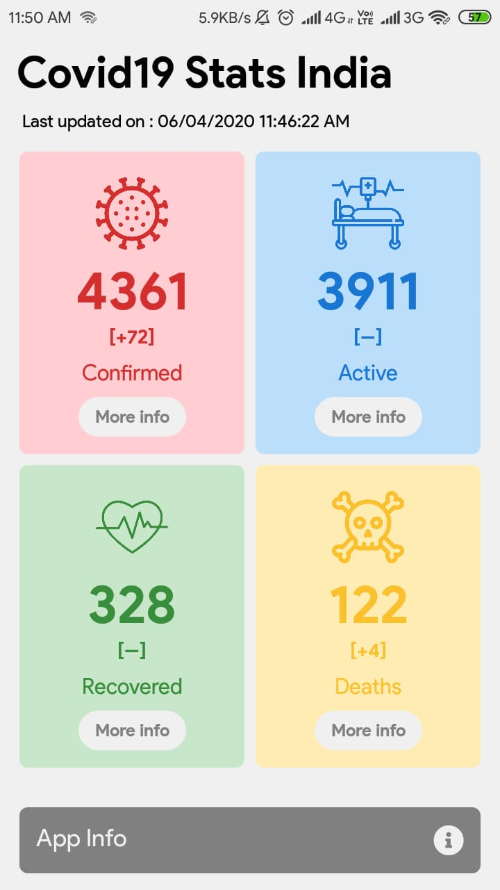
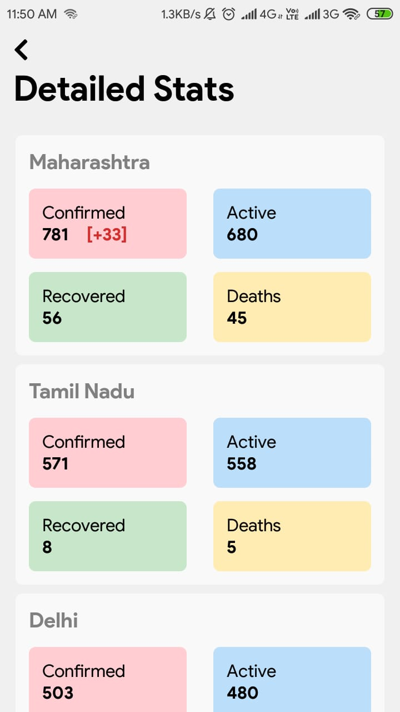
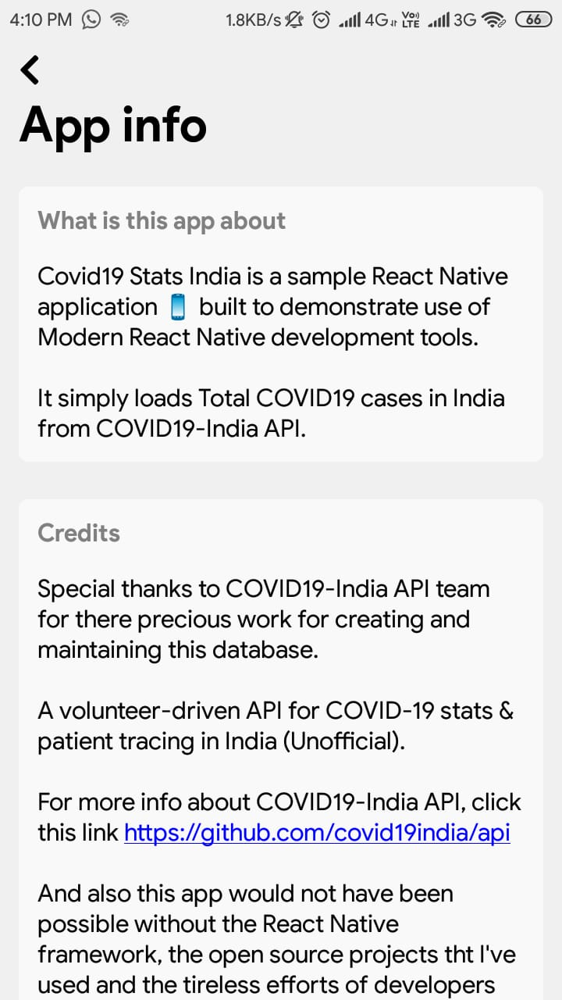

<p align="center">
  
</p>

# 🔔 COVID19 Stats - India

[](LICENSE)


**Covid19 Stats India** is a sample React Native application 📱 built to demonstrate use of _Modern React Native development_ tools. Dedicated to all React Native Developers with ❤️.

## Features

- [Redux](http://redux.js.org/)
- [Redux Saga](https://redux-saga.js.org/)
- [Redux Thunk](https://github.com/reduxjs/redux-thunk)
- [React Navigation](https://reactnavigation.org/)
- [React Native Gesture Handler](https://github.com/kmagiera/react-native-gesture-handler)
- [Axios](https://github.com/axios/axios)
- [Eslint](http://eslint.org/) ([Airbnb config](https://github.com/airbnb/javascript/tree/master/packages/eslint-config-airbnb))

For Hooks example check branch [master-v2-hooks](https://github.com/adityasonel/Covid19-Stats-IN/tree/master-v2-hooks)

## Screenshot





**_You can Install and test latest Covid19 Stats India app from below 👇_**

[](https://github.com/adityasonel/Covid19-Stats-IN/releases)

## About

- It simply loads **Total COVID19 cases in India** from [API](https://github.com/covid19india/api).
- It notifies total cases of COVID19 in India.
- It is offline capable 😃.

## Contribute

If you want to contribute to this library, you're always welcome!
See [Contributing Guidelines](CONTRIBUTING.md).

## Credits

Thanks to [COVID19India.org](https://github.com/covid19india/api) for open-source API.

## Contact

If you need any help, you can connect with me.

Visit:- [adityasonel.github.io](https://adityasonel.github.io)

## License

```
MIT License

Copyright (c) 2020 Aditya Sonel

Permission is hereby granted, free of charge, to any person obtaining a copy
of this software and associated documentation files (the "Software"), to deal
in the Software without restriction, including without limitation the rights
to use, copy, modify, merge, publish, distribute, sublicense, and/or sell
copies of the Software, and to permit persons to whom the Software is
furnished to do so, subject to the following conditions:

The above copyright notice and this permission notice shall be included in all
copies or substantial portions of the Software.

THE SOFTWARE IS PROVIDED "AS IS", WITHOUT WARRANTY OF ANY KIND, EXPRESS OR
IMPLIED, INCLUDING BUT NOT LIMITED TO THE WARRANTIES OF MERCHANTABILITY,
FITNESS FOR A PARTICULAR PURPOSE AND NONINFRINGEMENT. IN NO EVENT SHALL THE
AUTHORS OR COPYRIGHT HOLDERS BE LIABLE FOR ANY CLAIM, DAMAGES OR OTHER
LIABILITY, WHETHER IN AN ACTION OF CONTRACT, TORT OR OTHERWISE, ARISING FROM,
OUT OF OR IN CONNECTION WITH THE SOFTWARE OR THE USE OR OTHER DEALINGS IN THE
SOFTWARE.
```
